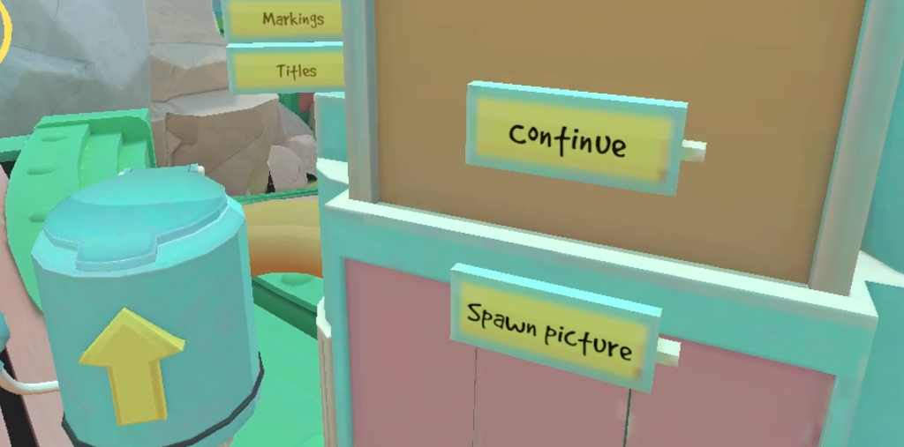
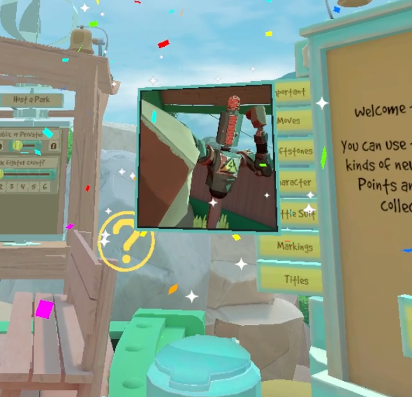

# Rumble Photo Album

This mod allows you to customize your play area with framed pictures.

## How to get an image from the disk into the game

Simply drop the images you want into `UserData/RumblePhotoAlbum/pictures`, and press the "Spawn picture" button on the Gear Market. The picture will be prompty delivered to you via the Mail Tube! You can then grab and reposition the picture as you like, and even resize it by grabbing it with two hands.

The configuration is saved in a json file, and each scene gets its own configuration. The only scene that cannot have framed pictures is the Loader.

In a future iteration of the mod, the park will also feature a copy of the Mail Tube and the "Spawn picture" button.

For multiplayer maps, there can't be extra stuff on the arena, so you'll have to experiment by manually editing the json file...

## Reloading all the pictures currently in the scene
Any time the mod configuration in ModUI is saved, all the pictures are reloaded. You can experiment with the color and size options to get the best fit for you while you're at it!

## What is the "stash"?
In the configuration file, there are two sections for each scene: the **"album"**, where all the picture positions are, and the **"stash"**, where you can have either file names (then we'll search in the `pictures` folder), or a full path! Image files that are in the `pictures` folder but not in the stash are automatically added to it.