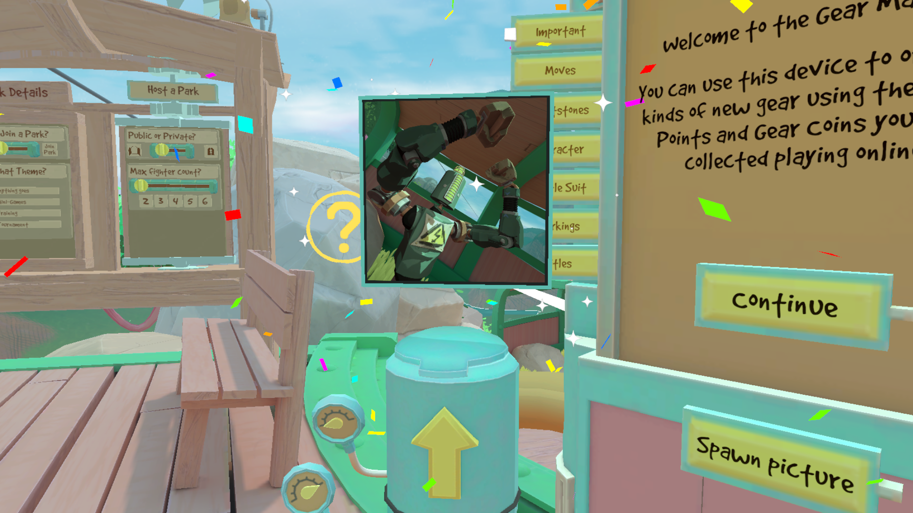

# Rumble Photo Album

This mod allows you to customize your play area with framed pictures.

## How to get an image from the disk into the game

Simply drop the images you want into `UserData/RumblePhotoAlbum/pictures`, and press the "Spawn picture" button on the Gear Market. The picture will be prompty delivered to you via the Mail Tube! You can then grab and reposition the picture as you like, and even resize it by grabbing it with two hands.

The configuration is saved in a json file, and each scene gets its own configuration. The only scene that cannot have framed pictures is the Loader.

The park also features a copy of the Mail Tube and the "Spawn picture" button.

For multiplayer maps, there can't be extra stuff on the arena, so you'll have to experiment by manually editing the json file... Or use the Rock Cam printing option!

## Rock Cam integration
You can print photos from your Rock Cam!

After taking a photo, press the "Print photo" button on the top of your cam, and a printed version will be spawned, attached to the camera!

If you detach the photo and press the button again, an older photo will be printed, until you run out of photos to print. But if you take another photo in the meantime, it will print the most recent one again.

You don't have to stay in the same scene to print, you can do it at any moment. The image file is copied to the UserData subfolder, so it's available for all scenes.

## Reloading all the pictures currently in the scene
Any time the mod configuration in ModUI is saved, all the pictures are reloaded. You can experiment with the color and size options to get the best fit for you while you're at it!