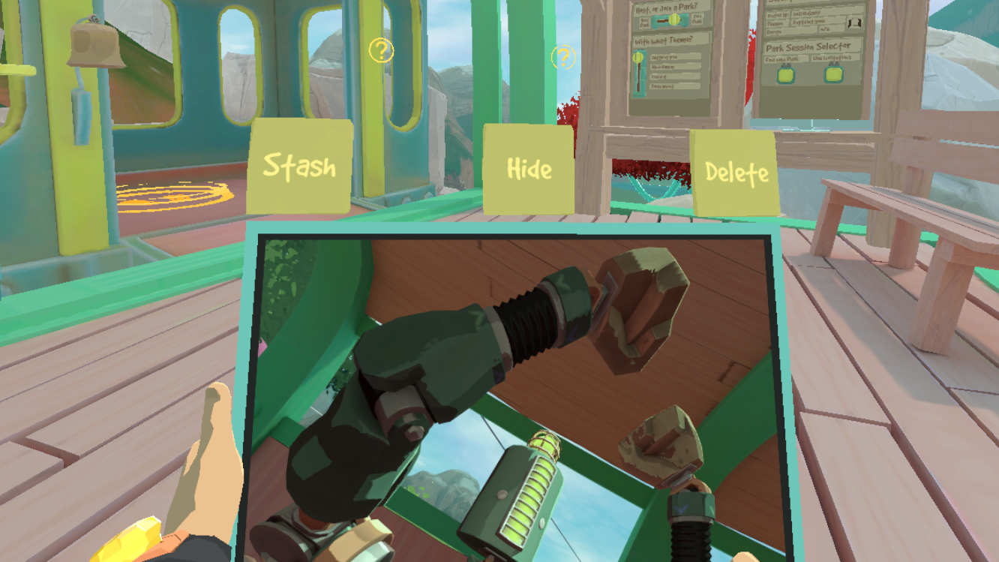

# Rumble Photo Album

This mod allows you to customize your play area with framed pictures.

## How to get an image from the disk into the game

Simply drop the images you want into `UserData/RumblePhotoAlbum/pictures`, and press the "Spawn picture" button on the Gear Market. The picture will be prompty delivered to you via the Mail Tube! You can then grab and reposition the picture as you like, and even resize it by grabbing it with two hands.

When you grab the picture, 3 buttons appear on top of it:
- **Stash:** removes the picture from the scene and puts it back into the stash, so that it can be spawned again
- **Hide/Show:** toggles the picture's visibility to legacy and LIV cameras (including Rock Cam). Useful for private photos!
- **Delete:** removes the picture from the scene AND deletes the file on disk if 2 conditions are satisfied:
    - the file is from the "pictures" folder
    - it's not used anywhere else in the album, not even in another scene

The configuration is saved in a json file, and each scene gets its own configuration. The only scene that cannot have framed pictures is the Loader.

You can also spawn a picture from anywhere on your computer by manually adding it's full path to the "stash" list in `UserData/RumblePhotoAlbum/config.json`, for the specific scene where you want the picture to be available.

The park also features a copy of the Mail Tube and the "Spawn picture" button.

For multiplayer maps, there can't be extra stuff on the arena, so you'll have to experiment by manually editing the json file... Or use the Rock Cam printing option!

## Rock Cam integration
You can print photos from your Rock Cam!

After taking a photo, press the "Print photo" button on the top of your cam, and a printed version will be spawned, attached to the camera!

If you detach the photo and press the button again, an older photo will be printed, until you run out of photos to print. But if you take another photo in the meantime, it will print the most recent one again.

You don't have to stay in the same scene to print, you can do it at any moment. The image file is copied to the UserData subfolder, so it's available for all scenes.

## Customization options
Many aspects of the frames can be customized via ModUI or by editing the config.json file in UserData.

- **Frame color:** global color can be set in ModUI. To change for any specific picture, add the field **"color"** to the json configuration of the picture.

- **Frame padding:** this is the little outline around the image, and can also be globally set in ModUI. To change for any specific picture, add the field **"padding"** to the json configuration of the picture.

- **Frame thickness:** global thickness can be set in ModUI. To change for any specific picture, add the field **"thickness"** to the json configuration of the picture.

- **Default picture size:** This only affects the initial size of a newly spawned picture, and can be changed via ModUI. You can resize a picture either by grabbing it or by adding the field **width** or **"height"** to the json configuration of the picture.

- **Transparency:** transparency is disabled by default because it's not very optimized, and makes a small lag spike when creating the picture. You can enable it globally via ModUI, but to enable it for any specific picture, add the field **"alpha": true** to the json configuration of the picture.

## Reloading all the pictures currently in the scene
Any time the mod configuration in ModUI is saved, all the pictures are reloaded.